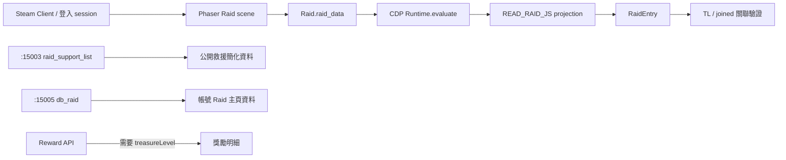

# Raid Treasure Level 資料來源分析

## 現況結論

1. 舊本機 CDP 不是從 DevTools Network、HTTP API 或 WebSocket frame 直接解析 Raid；正式 `RaidReader` 透過 CDP `Runtime.evaluate` 讀取遊戲 JavaScript runtime 中的 `game.scene.keys.Raid.raid_data`。
2. `treasure_level` 已在舊 research probe 與舊快照中出現，但目前正式 `RaidReader` 的 JavaScript projection 沒有保留它，因此建立 `RaidEntry` 前就已遺失。
3. 舊 CDP research 程式只讀取 Client 當下已有的 runtime object。現有證據沒有顯示它主動送出 `raid_code_input`、`db_raid`、`db_raid_reward`、`db_raid_delete`、參戰、戰鬥或領獎指令。
4. 舊快照中的 TL 樣本同時為 `already_joined=true`。這只能證明「曾讀到一筆已參與且有 TL 的 Raid」，不能證明 TL 必須參與後才可見。
5. `:15003 raid_support_list` 與遊戲 Raid 主頁的 `db_raid` 是不同資料集合。前者提供公開救援清單的簡化欄位；後者是 Client Raid 主頁資料，包含較完整 metadata 的可能性已由前端與舊 research 證實。
6. 新增的 `api-raid-rewards-query.md` 說明 Reward API 以 `treasureLevel` 查詢獎勵，但沒有提供 `prf_code → treasureLevel` 的轉換方法，因此不解決目前關聯缺口。

## 程式碼證據

### A. CDP 實際資料來源

- `raid_bot/infrastructure/raid_reader.py:15-142`：`READ_RAID_JS` 取得 `globalThis.game?.scene?.keys?.Raid`，再讀取 `raid.raid_data`。
- `raid_bot/infrastructure/raid_reader.py:176-183`：`RaidReader.read_snapshot()` 將 `READ_RAID_JS` 交給 `CDPClient.evaluate()`。
- `raid_bot/infrastructure/cdp_client.py`：`CDPClient.evaluate()` 委派給 ULSniffer。
- `tool/core/runtime/cdp/ul_sniffer.py:99-118,231-263`：在包含 `window.game` 的 execution context 執行 `Runtime.evaluate`。

因此這條資料流是 JavaScript runtime / Phaser scene object，不是 Network panel、HTTP API 或 WebSocket frame parser。

### B. treasure_level 第一次出現與遺失位置

舊 research（目前工作樹中已刪除，但 Git HEAD 可查）：

- `HEAD:tool/raid-bot/research/detect_raid_list.py`：從 `raid.raid_data` projection 取出 `row?.treasure_level ?? null`。
- `HEAD:tool/raid-bot/research/detect_raid_reward_state.py`：同樣從 `raid.raid_data` 讀取 `treasure_level`，並被動讀取 Client 已有的 reward state。
- `HEAD:tool/raid-bot/research/snapshots/raid_list_snapshot.json`：保存過 `treasure_level=2079`、`already_joined=true` 的實際快照。

目前正式資料流：

```text
Raid.raid_data
  → READ_RAID_JS projection（原本漏掉 treasure_level）
  → RaidReader.read_snapshot()
  → RaidEntry（模型已有 optional treasure_level）
```

`raid_bot/domain/models.py:97` 已有 `RaidEntry.treasure_level`，缺口在 CDP projection 與建構時的欄位接線，不是 domain model。

### C. CDP 是否主動改變 Raid 狀態

在舊 research CDP 檔案中搜尋不到以下主動操作：

- `raid_code_input`
- `db_raid_delete`
- `db_raid_reward` request
- `socket.emit`
- join / battle / claim action

`HEAD:tool/raid-bot/research/detect_raid_dual_source.py` 曾被動註冊 `socket.on("db_raid")` 觀察 Client 已收到的事件，並讀取 `raid.raid_data`；它沒有發送 `db_raid`。

遊戲 bundle 則可確認正式 Client Raid 主頁會執行：

```javascript
this.raid_data = await this.socket.fetch("db_raid", this.id)
this.raid_reward_data = await this.socket.fetch("db_raid_reward", this.id)
```

以及後續 `emit("db_raid", this.id)` / `on("db_raid", ...)` 更新。這是遊戲 Client 自己的行為，不是舊 CDP probe 主動觸發。

### D. 是否能證明 TL 需要參與

不能。

目前能證明的只有：

- `already_joined` 是用 `points` 中是否存在 `raid.player.name` 判定。
- 舊保存快照有一筆 `already_joined=true` 且 `treasure_level=2079`。

目前沒有保存到以下任一可作反證或支持的完整樣本集合：

- 未參與且有 TL
- 未參與且無 TL
- 已參與但無 TL

因此「CDP 因為擁有登入 session，所以能直接看到所有公開 Raid 的 TL」與「TL 必須參與 Raid 才能看到」都尚未由程式碼或樣本證實。

## 三條資料來源比較

| Source | 實際來源／事件 | 已由程式碼取得的欄位 | 目前缺口 |
|---|---|---|---|
| 本機 CDP | `Runtime.evaluate` 讀 `Raid.raid_data` | profound_id、pass、founder、monster、rarity、level、map、stage、HP、points、state；舊 research 另讀到 treasure_level | 正式 `RaidReader` 尚未傳遞 TL；未驗證未參與 Raid 是否有 TL |
| VPS `:15003` | `raid_get_support(owner_id)` → `raid_support_list` | prf_code、prf_name、prf_mons、prf_founder、HP、member、limit | 沒有 map、stage、rarity、treasure_level；資料集合是救援清單 |
| `:15005` | `register(owner_id)` → `db_raid(owner_id)` | normalizer 已預留 profound metadata、map、stage、rarity、HP 等 | 實測曾收到空陣列；尚未以 VPS 帳號取得非空 TL 樣本，也未證明權限／參與條件 |

## 資料流



## 可重用方法與下一步

舊 CDP 已有可重用的方法：讀取 `Raid.raid_data`，並以 `points[].name == raid.player.name` 計算 `already_joined`。最小驗證不需要 worker，也不需要發送任何遊戲 WebSocket 事件：

1. 讓正式 CDP projection 保留 `treasure_level`。
2. 建立獨立、只讀 probe，一次列出每筆 Raid 的 TL 與 `already_joined`。
3. 統計 joined/unjoined × with/without TL 四種組合。
4. 特別保存「未參與但有 TL」案例；只要出現一筆，就能否定「TL 必須參與後才可見」這個絕對命題。

在取得本機 runtime 實測結果以前，不應據此啟動 worker、join/delete 流程或改動 VPS production 架構。

## 2026-08-08 後續實測更新

後續本機 CDP 實測取得四筆已參與 Raid，並以 Reward API 的 `ranking` 獎勵完成交叉驗證：

| treasure_level | Boss | ranking 碎片 | 顯示 |
|---:|---|---|---|
| 2079 | 黑死獸 | 生命碎片 | 紅／🔴 |
| 2080 | 黑死獸 | 死亡碎片 | 紫／🟣 |
| 2093 | 靈龜 | 靈魂碎片 | 藍／🔵 |
| 2095 | 靈龜 | 死亡碎片 | 紫／🟣 |

因此以下鏈路已由實際樣本驗證：

```text
已參與 Raid
  → Raid.raid_data.treasure_level
  → Reward API
  → ranking 碎片
  → 顏色／Emoji
```

仍未由真實環境驗證的是公開、未參與 Raid 的自動 enrichment：

```text
raid_support_list.prf_code
  → worker raid_code_input
  → db_raid 中的新 row
  → treasure_level
  → cleanup
```

### 公開未參與 Raid 實機驗證

後續以原本未參與的公開 Raid 完成單筆 enrichment 實測：

```text
prf_code=1uJ2UapsKq7h
founder=xup6
boss=靈龜
treasure_level=2091
ranking fragment=記憶碎片（黃）
preview=👤 xup6 黃龜🟡🐢 ❤️5364/6000
cleanup_attempted=True
cleanup_confirmed=True
```

該次 scanner 整體 summary 為 `ok=false`、`join_outcome=timeout`，因此不能稱為
完整 scanner run 成功；但 `treasure_level`、Reward enrichment 與 cleanup
三個本次關注的子流程均成功，足以作為 production cleanup 時序的實機基準。

這筆結果確認以下完整鏈路可行：

```text
公開 raid_support_list
  → prf_code
  → worker raid_code_input
  → 唯一 pass == prf_code 的 db_raid row
  → treasure_level
  → Reward API / FragmentResolver
  → Discord formatter
  → db_raid_delete
  → cleanup confirmation
```

這證明 worker 參與後能取得該公開 Raid 的 TL；它強力支持「此類公開 Raid
需先參與才可見 TL」，但不把單筆樣本外推為所有 Raid 權限情境的絕對規則。
