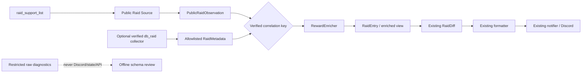

# Raid 資料來源分析

## 結論

目前 VPS Raid Bot 與舊桌面研究工具的主要差異確實是「資料來源
層級」，不是 Discord formatter 把所有資料蓋掉。

程式確認的兩條路徑是：

```text
VPS WebSocket
→ register(owner_id)
→ raid_get_support(owner_id)
→ raid_support_list
→ prf_* 公開支援清單
```

```text
Steam / Electron
→ CDP
→ window.game.scene.keys.Raid
→ Raid.socket db_raid event / fetch
→ Raid.raid_data
→ map / stage / rarity / level / state / points / treasure_level
```

兩支 Python `raid_watcher*.py` 都屬於第一條。它們只會把
`raid_support_list` raw args 印出，並沒有呼叫 `raid_code_input`、
`db_raid` 或其他 detail API。

舊工具中真正拿到豐富欄位的是 `src/script/ulr_raid_info.js`
與 `research/detect_raid*.py`；它們依賴已登入遊戲的 Raid scene、
現有 authenticated socket 或 CDP context。

目前可以證明深層資料在遊戲內可讀，但還不能證明這套
authenticated `db_raid` protocol 已可在 VPS 上獨立、無狀態變更地執行。
「80% 資料可拉到」是合理的 research hypothesis，不是目前程式已驗證
的比例。

---

## 1. 目前 VPS WebSocket source

目前正式 source：
[`raid_bot/infrastructure/websocket_raid_source.py`](raid_bot/infrastructure/websocket_raid_source.py)

### Protocol

```text
wss://www.playunlight.online:15003/

register          [owner_id]
raid_get_support  [owner_id]
raid_support_list [rows]
```

程式只處理 `raid_support_list`，其他非 protocol control event 都會被忽略。

證據：

- [`websocket_raid_source.py`](raid_bot/infrastructure/websocket_raid_source.py#L169)
- [`websocket_raid_source.py`](raid_bot/infrastructure/websocket_raid_source.py#L248)

### 已驗證 raw row 欄位

```text
prf_code
prf_name
prf_mons
prf_founder
prf_hp
prf_member
prf_limit
```

目前 normalizer 轉換：

| Raw | `RaidEntry` |
| --- | --- |
| `prf_code` | `profound_id` |
| `prf_name` | `boss_name` |
| `prf_mons` | `monster_code` |
| `prf_founder` | `founder` |
| `prf_hp` | `hp` / `hp_max` |
| `prf_member` | `participant_count` / `member_limit` |
| `prf_limit` | `expires_at` |

證據：
[`websocket_raid_source.py`](raid_bot/infrastructure/websocket_raid_source.py#L41)

### Normalize 層是否會丟資料

會。`normalize_raid_support_list()` 是 allowlist-style construction，只取上表欄位。
如果 raw row 實際還有其他 key，它們不會進入 `RaidEntry`。

`RaidEntry` 雖然有 `raw` 欄位，WebSocket normalizer 沒有將 `row`傳給它，
所以目前會使用預設空 dict。

證據：

- [`models.py`](raid_bot/domain/models.py#L117)
- [`websocket_raid_source.py`](raid_bot/infrastructure/websocket_raid_source.py#L70)

但必須區分兩件事：

1. **程式已證實**：normalizer 會忽略未列出的 key。
2. **目前沒有證實**：實際 `raid_support_list` row 原本就含有
   `map`、`stage`、`rarity` 或 reward，只是被 normalizer 丟掉。

現有 raw watcher 與已提供樣本都只看到 `prf_*` 公開清單欄位。
要驗證是否還有額外 key，應觀察 normalize 前的 key schema，而不是
從 `RaidEntry` 反推。

## 2. `raid_watcher.py` 與 `raid_watcher20260805.py`

位置：

- [`src/script/raid_watcher.py`](../../src/script/raid_watcher.py)
- [`src/script/raid_watcher20260805.py`](../../src/script/raid_watcher20260805.py)
- [`src/script/ws_client.py`](../../src/script/ws_client.py)

兩版 watcher 的資料流相同：

```text
register
→ raid_get_support
→ raid_support_list
→ json.dumps(args)
```

證據：

- [`raid_watcher.py`](../../src/script/raid_watcher.py#L22)
- [`raid_watcher20260805.py`](../../src/script/raid_watcher20260805.py#L23)

兩者差異只是後者將 owner ID 與 endpoint 改為環境變數。
它們都沒有：

- `raid_code_input`
- `db_raid`
- `db_raid_delete`
- `db_raid_reward`
- `db_item_raid`

因此「舊 watcher 比目前 VPS source 拿到更深資料」若指的是這兩支
Python watcher，結論不成立。它們與目前 VPS source 使用相同的
support-list protocol。

## 3. 真正的舊深層資料來源

### `ulr_raid_info.js`

位置：[`src/script/ulr_raid_info.js`](../../src/script/ulr_raid_info.js)

這支 userscript 會在 `window.game.scene.keys.Raid` 內 patch scene，然後監聽：

```javascript
this.socket.on("db_raid", data => { ... })
```

它直接使用 `db_raid` entry 的：

- `name_tcn`
- `profound_founder`
- `pass`
- `rarity`
- `stage`
- `map`
- `treasure_level`
- `state`
- `points`

並使用 `rarity + stage` 計算碎片文字。

證據：

- [`ulr_raid_info.js`](../../src/script/ulr_raid_info.js#L59)
- [`ulr_raid_info.js`](../../src/script/ulr_raid_info.js#L85)

這是遊戲內已認證 Raid socket 的 event data，不是 15003 support-list
watcher 的 response。

### CDP research

[`research/detect_raid_list.py`](research/detect_raid_list.py#L26) 直接讀取：

```text
window.game.scene.keys.Raid.raid_data
```

讀取欄位包含：

- `profound_id`
- `profound_mons`
- `name_tcn`
- founder
- `rarity`
- `level`
- `map`
- `stage`
- HP
- `member_limit`
- `pass`
- `state`
- `points`
- `treasure_level`

[`research/detect_raid_dual_source.py`](research/detect_raid_dual_source.py#L63)
同時監聽 `Raid.socket` 的 `db_raid` 事件，並與
`Raid.raid_data` 比較。當次 48 個樣本中，Raid ID 清單沒有出現
不一致的樣本；部分樣本只是 HP、state、points 等動態內容有
時間差。

這證明：

```text
db_raid event data
≈ Raid scene.raid_data
```

但它仍是已登入 Steam/Electron 遊戲內的驗證，不是獨立 VPS
collector 的驗證。

## 4. 遊戲前端內可確認的 Raid protocol

專案保留的遊戲 bundle：

```text
scripts/import/har/js/755.3b4b47183730a0cef19f.js
```

這是 minified 快照，所有以下證據都在該檔第 1 行，應以 event
字串搜尋，不適合用普通行號閱讀。

| Event / fetch | 前端實際用法 | 性質 | 是否適合當無狀態 detail collector |
| --- | --- | --- | --- |
| `raid_get_support(id)` | 取得支援清單 | 讀取 | 已用於 VPS，但欄位少 |
| `raid_support_list` | support list response | 事件 | 已用於 VPS |
| `db_raid(id)` | fetch 帳號 Raid list，也有更新事件 | 讀取 | 值得研究，但獨立 VPS 認證／endpoint 尚未驗證 |
| `raid_code_input(id, code)` | 玩家輸入 support code 並嘗試加入 Raid | **會變更帳號狀態** | 不應當一般讀取 collector |
| `raid_code_error` | 加入失敗：包含數量上限、無效碼、過期、AP 不足等 | 事件 | 證明 code input 不是無狀態 detail lookup |
| `db_raid_delete(id, raid_id)` | UI 放棄／刪除已有 Raid | **破壞性狀態變更** | **不可用來取 detail** |
| `db_raid_reward(id)` | fetch 帳號待處理的 Raid 參加獎勵 | 讀取 | 可研究獎勵結算，不是以 support code 查單筆 detail |
| `db_item_raid(id)` | fetch 帳號持有的 Raid 道具／探測機 | 讀取 | 不是 Boss 獎勵對應表 |
| `raid_ready` | 進入 Raid battle 的 room/config 時序 | 狀態過渡 | 不是公開清單 enrichment API |
| `raid_found` | 用探測機發現 Raid 後的事件 | 狀態過渡 | 不是 support detail lookup |

### `raid_code_input` 不是純讀取

前端會在玩家確認參加 support Raid 後送出：

```text
raid_code_input(this.id, selected.prf_code)
```

前端同時處理的 `raid_code_error` 包含：

- 不能再參加更多 Raid。
- Raid code 無效。
- Raid 過期。
- AP 不足。
- Raid 已變更或刪除。
- 沒有 current deck。
- 攻略數已達上限。

所以它的語意是「加入 Raid」，可能受 AP、deck、參戰數限制，
不是免費、無狀態的 detail request。

### `db_raid_delete` 不是 collector

前端只在玩家確認放棄渦後送出：

```text
db_raid_delete(this.id, this.raid_id)
```

這會從帳號的 Raid 狀態中移除／放棄目標。不應在監控帳號上
自動執行，更不應把它設計成每 10 秒輪詢的 enrichment 步驟。

## 5. 資料欄位對照

符號：

- ✅：程式／research 實際有欄位證據。
- ❌：現有來源沒有。
- ⚠️：可推導或只在特定已登入帳號情境可讀，尚不是已驗證
  VPS enrichment。

| 資料 | 目前 15003 WS | Python `raid_watcher*` | `db_raid` / Raid scene | 來源／說明 |
| --- | --- | --- | --- | --- |
| Public support code | ✅ `prf_code` | ✅ | ❌／未證明與 `profound_id` 相同 | `raid_support_list` |
| Raid ID | ⚠️ normalizer 目前把 `prf_code` 放入 `profound_id` | ⚠️ | ✅ `profound_id` | 兩套 ID 是否相同尚未關聯驗證 |
| Boss 名稱 | ✅ `prf_name` | ✅ | ✅ `name_tcn` | support list / `db_raid` |
| Monster code | ✅ `prf_mons` | ✅ | ✅ `profound_mons` | support list / `db_raid` |
| Founder | ✅ `prf_founder` | ✅ | ✅ `profound_founder` | support list / `db_raid` |
| HP | ✅ `prf_hp` | ✅ | ✅ `hp`, `hp_max` | support list 是字串 pair，`db_raid` 是數值 |
| 人數 | ✅ `prf_member` | ✅ | ✅ `points` | support list 是 current/max，`db_raid` 有玩家列表 |
| 到期時間 | ✅ `prf_limit` | ✅ | ✅ `limit` | 兩來源均有 |
| Map | ❌ | ❌ | ✅ `map` | `db_raid` / `Raid.raid_data` |
| Stage | ❌ | ❌ | ✅ `stage` | `db_raid` / `Raid.raid_data` |
| Rarity | ❌ | ❌ | ✅ `rarity` | `db_raid` / `Raid.raid_data` |
| 6 星 | ❌ | ❌ | ⚠️ 由 `rarity == 6` 判斷 | research 當次樣本只看到 rarity 1 |
| Level | ❌ | ❌ | ✅ `level` | `db_raid` / `Raid.raid_data` |
| Difficulty | ❌ | ❌ | ❌ 沒有名為 difficulty 的已驗證欄位 | 不應把 level／rarity 自動改名為 difficulty |
| Treasure level | ❌ | ❌ | ✅ `treasure_level` | 語意與獎勵對應尚未完成驗證 |
| Status | ❌ | ❌ | ✅ `state` | `db_raid` / `Raid.raid_data` |
| Ranking / points / damage | ❌ | ❌ | ✅ `points` | 僅已加入／可見的帳號 Raid |
| Pass code | ❌ | ❌ | ✅ `pass` | 不應公開或當 reward key |
| Fragment color | ❌ | ❌ | ⚠️ 由 rarity/stage 舊規則計算 | 不是 `db_raid` 明示 fragment 欄位 |
| 實際獎勵 | ❌ | ❌ | ⚠️ `db_raid_reward` 是另一份帳號參加獎勵資料 | 現有 30 次 probe 皆為空 list |
| Raid 道具庫存 | ❌ | ❌ | ✅ `db_item_raid` | 這是帳號物品，不是 Boss 掉落 |

## 6. `prf_code` 是否可當 detail key

前端 bundle 確實將 support row 的 `prf_code` 傳給：

```text
raid_code_input(player_id, prf_code)
```

這證明 `prf_code` 是遊戲加入 support Raid 所使用的 code。

但現有程式沒有證明：

```text
prf_code == db_raid.profound_id
```

也沒有找到一個無狀態 API 可以直接使用 `prf_code` 取回
map/stage/rarity，而不將 Raid 加入監控帳號。

因此 `prf_code` 是後續關聯研究的重要候選 key，但現在不應直接
宣告它就是 detail record primary key。

## 7. `db_raid_reward` 與實際獎勵

遊戲前端在 Raid scene 啟動時另外 fetch：

```text
db_raid_reward(player_id)
```

並監聽 `db_raid_reward` update event。它與 `db_raid` 是兩份不同資料。

[`research/detect_raid_reward_state.py`](research/detect_raid_reward_state.py#L164)
已嘗試取得：

- `raid_reward_data`
- reward-like row fields
- `item_info_raid`
- visible reward text

當次 30 份記錄的 `raid_reward_data` 都是空 list，沒有捕獲到
某個 Raid ID 對應某項實際獎勵的結算證據。

`item_info_raid` 內容是α／β渦探知機與活動探測杖，不是碎片
掉落表。

獎勵現況的詳細分級請見
[`RAID_REWARD_ANALYSIS.md`](RAID_REWARD_ANALYSIS.md)。

## 8. 建議的 enrichment 方向

### 保留現有 VPS 主流程

```text
raid_support_list
→ WebSocketRaidSource
→ RaidEntry
→ RaidDiff
→ formatter
→ Discord
```

這條流程已負責即時新 Raid 偵測、baseline、去重與合併通知。
資料豐富化不應取代或重寫它。

### 不建議將無限制 raw payload 直接傳給 formatter

`RaidEntry.raw` 可用於本機、短生命週期的診斷，但原始 authenticated
payload 可能包含玩家資料、pass code、token 或其他限制欄位。
它不應直接進 Discord、state JSON 或公開 API。

建議的邊界是：

```text
Public Raid Source
→ PublicRaidObservation

Optional Detail Collector
→ allowlisted RaidMetadata

PublicRaidObservation + RaidMetadata
→ RewardEnricher
→ RaidEntry / enriched view
→ formatter
```

重點是「先在 source boundary 驗證並 allowlist 欄位」，而不是把不受限
raw dict 交給 Discord formatter 自由使用。

### 可能的 collector 選項

#### A. 確認 `raid_support_list` 本身有無額外 key

風險最低，應最先做。只收集：

- event 名稱。
- row key 清單。
- value type。
- 不記錄 owner ID、founder、support code 實值或完整 raw payload。

若實際 row 真有 map/stage/rarity，再將這些「已驗證欄位」加入
normalizer。目前尚無此證據。

#### B. 被動 `db_raid` collector

遊戲內已證明 `db_raid(id)` 可取得豐富 Raid list。但在 VPS 前還需驗證：

- 實際 socket endpoint 與 handshake。
- player ID 以外還需要哪些 authentication/session state。
- 定時只呼叫 `db_raid` 是否真正無狀態變更。
- 帳號的 `db_raid` 只包含自己發現／已加入 Raid，還是包含所有
  public support Raid。
- `prf_code` 與詳細 row 的可驗證關聯方式。

在這些問題沒有答案前，`db_raid` 是 research candidate，不是已完成
VPS source。

#### C. 桌面 CDP enricher

現有 `RaidReader` 與 research 已會讀 `Raid.raid_data`。這適合桌面版或
研究驗證，但不適合沒有 Steam/Electron 的純 VPS 部署。

#### D. 透過 `raid_code_input` 加入後再查 `db_raid`

這不是純讀取 enrichment：

- 會變更監控帳號的 Raid 參與狀態。
- 可能受 AP、deck、參與數上限影響。
- 無法穩定查詢所有 public Raid。
- 後續使用 `db_raid_delete` 清理又是破壞性狀態變更。

若未來要研究，必須使用明確授權的隔離測試帳號，並先建立
單次、手動確認的實驗。不應直接加入每 10 秒的生產輪詢。

## 9. 建議驗證順序

### Phase 0：保留目前生產行為

- 不改 WebSocket protocol。
- 不改 formatter。
- 不啟用 reward prediction。
- 不呼叫 `raid_code_input`。
- 不呼叫 `db_raid_delete`。

### Phase 1：驗證 support raw schema

對多個新 Raid 只記錄去識別的 key/type schema，確認：

```text
raid_support_list row 是否真的只有 prf_* 欄位
```

若沒有額外 key，就可排除「只是 normalizer 丟掉 map/stage/rarity」。

### Phase 2：驗證 ID 關聯

在桌面版以人工、單次流程：

1. 記錄某個 support row 的去識別 fingerprint。
2. 由玩家手動加入該 Raid。
3. 讀取加入後的 `db_raid` row。
4. 比對 `prf_code`、`profound_id`、monster code、founder、HP 與到期時間。
5. 確認可靠 join key，不記錄 pass code、token 或玩家名稱。

這一階段不自動化 `raid_code_input`。

### Phase 3：被動 detail collector feasibility

只研究 `register + db_raid`，不加入或刪除 Raid。驗證 endpoint、認證、
輪詢安全性與 list scope。

### Phase 4：接入 RewardEnricher

只在以上證據完整後，將已驗證的 metadata 以 allowlist 形式交給
enricher。新 Raid diff 與 Discord notifier 繼續使用目前實作。

## 10. 建議架構



實作前的必要決策是：

1. 使用哪個已驗證的關聯 key。
2. Detail collector 是否真正被動且無帳號狀態變更。
3. 哪些 metadata 允許進入生產 domain／Discord。
4. Detail 未到、過期或無法關聯時，是否維持現有無 enrichment
   通知。建議維持 fail-open-to-public-data：仍通知 Boss/HP/人數，
   但不猜獎勵。

## 11. 目前可確定與尚未確定

### 已確定

- 15003 `raid_support_list` 可穩定提供 public Raid 基本資料。
- Python `raid_watcher*.py` 與目前 VPS source 使用相同 support protocol。
- 目前 normalizer 只保留 allowlist 欄位，其他 raw key 會被忽略。
- 遊戲內 `db_raid` / `Raid.raid_data` 有 map、stage、rarity、level、
  state、points、treasure level 等豐富資料。
- `ulr_raid_info.js` 使用的是 `db_raid`，不是 `raid_support_list`。
- `raid_code_input` 是加入 Raid 的狀態變更操作。
- `db_raid_delete` 是放棄／刪除 Raid 的破壞性操作。
- `db_raid_reward` 與 `db_item_raid` 是帳號層資料，不是 public
  support detail response。

### 尚未確定

- `raid_support_list` raw row 是否在某些場景含有未列入樣本的額外 key。
- `prf_code` 與 `db_raid.profound_id` 的精確關係。
- 是否存在以 `prf_code` 無狀態取得 detail 的另一個 event/API。
- `db_raid` 在獨立 VPS client 上所需的完整認證流程。
- 監控帳號的 `db_raid` 能否覆蓋未加入的 public Raid。
- `treasure_level` 的精確語意與獎勵關聯。
- 實際碎片獎勵的 item code、數量與結算事件。
- 獨立使用第二帳號執行 detail collector 是否符合遊戲規則與
  長時間穩定性需求。

## 建議的下一步

下一步不是改 formatter，也不是自動化 `raid_code_input`。

最小、安全且能直接排除關鍵假設的工作是：

> 收集多份 `raid_support_list` 在 normalize 前的去識別 key/type schema，
> 確認 map、stage、rarity 是來源根本沒有，還是現有 normalizer
> 未保留。

完成後，再決定是單純擴充 allowlist，還是需要一個經驗證的
`db_raid` detail collector。
