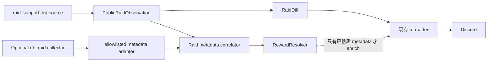

# Raid Reward 深層資料來源分析

## 結論

`db_raid` 是遊戲前端實際使用的 WebSocket 資料，不是推測出的事件。
同一個 Raid scene socket 同時負責：

```text
raid_get_support → raid_support_list
db_raid request  → db_raid response/update
```

但目前不能因此宣告 VPS 已經能被動取得 `db_raid`：

- 遊戲前端會在 Raid scene 初始化時主動
  `fetch("db_raid", player_id)`。
- UI 更新時也會主動 `emit("db_raid", player_id)`，再由
  `socket.on("db_raid", ...)` 接收。
- 舊 Tampermonkey script 只是在已登入遊戲內掛 listener，搭便車取得
  遊戲主動要求的資料；它沒有自行建立或認證 WebSocket。
- 目前 VPS source 只送 `register` 與 `raid_get_support`。Raw Capture
  至今沒有證明伺服器會在這條路徑上主動推送 `db_raid`。

因此現況應描述為：

```text
db_raid protocol：已確認存在
db_raid payload：已在桌面登入環境確認
目前 VPS 被動取得：未確認，現有觀測為沒有
VPS 主動 read-only request：技術上有前端依據，尚待隔離實驗
可否涵蓋所有 public support Raid：未確認，而且很可能只涵蓋帳號自己的 Raid
```

還有兩個不能跳過的資料語意問題：

1. `raid_support_list.prf_code` 沒有證據等於
   `db_raid.profound_id`。較合理的候選是 `db_raid.pass`，但尚未用同一
   Raid 的同步樣本證實。
2. `ulr_raid_info.js` 用 `rarity + stage` 算碎片；保存的 ULRMap Wiki
   則寫成「地圖對應碎片」。既有研究樣本曾出現 `map != stage`，所以這
   兩條規則不能在未驗證前視為同一件事。

本階段不應修改 Discord formatter，也不應先建立 Boss → 碎片 mapping。

---

## 1. 已確認資料來源

### 1.1 `raid_support_list`：目前 VPS 生產來源

正式 source：
[`raid_bot/infrastructure/websocket_raid_source.py`](raid_bot/infrastructure/websocket_raid_source.py)

目前送出：

```text
register          [owner_id]
raid_get_support  [owner_id]
```

目前接收並 normalize：

```text
raid_support_list
```

已驗證 row 欄位：

| 欄位 | 用途 |
| --- | --- |
| `prf_code` | public support code；目前暫作 Raid ID |
| `prf_name` | Boss 名稱 |
| `prf_mons` | monster code |
| `prf_founder` | 發現者 |
| `prf_hp` | HP pair |
| `prf_member` | 人數 pair |
| `prf_limit` | 到期時間 |

這份資料沒有已驗證的 `map`、`stage`、`rarity` 或
`treasure_level`。

目前 v0.2 Raw Capture 會在 normalize 前保存所有可解析入站 event 的
`event + args`。它能用來確認未來是否出現 `db_raid`，但不會主動要求
`db_raid`。

證據：

- [`websocket_raid_source.py`](raid_bot/infrastructure/websocket_raid_source.py#L47)
- [`websocket_raid_source.py`](raid_bot/infrastructure/websocket_raid_source.py#L168)
- [`websocket_raid_source.py`](raid_bot/infrastructure/websocket_raid_source.py#L231)
- [`websocket_raid_source.py`](raid_bot/infrastructure/websocket_raid_source.py#L280)

### 1.2 `db_raid`：遊戲內已確認的深層來源

保存的遊戲 bundle：

```text
scripts/import/har/js/755.3b4b47183730a0cef19f.js
```

該檔是 minified 單行 bundle，所有引用都在第 1 行，應以事件字串定位。

前端 Raid scene 初始化時會執行：

```javascript
this.raid_data = await this.socket.fetch("db_raid", this.id)
```

前端在多個更新點也會執行：

```javascript
this.socket.emit("db_raid", this.id)
```

並持續監聽：

```javascript
this.socket.on("db_raid", data => {
  this.raid_data = data
})
```

同一個 `this.socket` 也執行：

```javascript
this.socket.emit("raid_get_support", this.id)
this.socket.on("raid_support_list", ...)
```

所以 `db_raid` 與 support list 屬於同一套遊戲 socket API，而不是 HTTP
頁面或 Phaser object 自行產生的假資料。

已確認 `db_raid` payload 是 array，entry 至少曾包含：

| 類別 | 欄位 |
| --- | --- |
| Raid identity | `profound_id`, `profound_date`, `pass` |
| Boss | `profound_mons`, `name_tcn` |
| Founder | `profound_founder`, `profound_founder_id` |
| Reward inputs | `rarity`, `map`, `stage`, `treasure_level` |
| Runtime state | `hp`, `hp_max`, `level`, `limit`, `member_limit`, `state` |
| Participants | `points`，內含玩家 point / damage |

`pass`、founder ID、points 等不是 Discord 所需資料，不應由 detail
collector 原樣外流。

### 1.3 舊 Tampermonkey `ulr_raid_info.js`

位置：[`data/ulr_raid_info.js`](data/ulr_raid_info.js)

script 會等待 `window.game.scene.keys.Raid`，patch `Raid.init`，然後在
scene 的既有 socket 上加入：

```javascript
this.socket.on("db_raid", data => { ... })
```

它直接讀取：

- `entry.profound_mons`
- `entry.profound_founder`
- `entry.pass`
- `entry.rarity`
- `entry.stage`
- `entry.map`
- `entry.treasure_level`
- `entry.state`
- `entry.points`

證據：

- [`ulr_raid_info.js`](data/ulr_raid_info.js#L59)
- [`ulr_raid_info.js`](data/ulr_raid_info.js#L85)
- [`ulr_raid_info.js`](data/ulr_raid_info.js#L95)

這證明欄位在已登入遊戲情境中存在，但不證明 userscript 知道認證方式。
userscript 本身沒有 endpoint、owner registration 或 handshake 實作。

### 1.4 CDP research：`db_raid` 與 `Raid.raid_data`

[`research/detect_raid_list.py`](research/detect_raid_list.py#L26) 直接讀取：

```javascript
window.game.scene.keys.Raid.raid_data
```

並 allowlist `profound_id`、monster、founder、rarity、map、stage、
treasure level 等欄位。

[`research/detect_raid_dual_source.py`](research/detect_raid_dual_source.py#L63)
同時監聽 `Raid.socket.on("db_raid")`，再與 `Raid.raid_data` 比對。
先前研究彙總中，48 個比較樣本沒有出現 ID 清單不一致；非 exact match
主要來自 HP、state、points 等動態更新時間差。

因此可確認：

```text
db_raid event/fetch payload
→ Raid scene 寫入 raid_data
→ CDP 可再從 window.game 讀到
```

CDP 並不是另一個 reward source；它只是讀取遊戲已經取得的
`db_raid` 資料。

---

## 2. `db_raid` 是否能被 VPS 被動取得

### 2.1 單純 listener：目前答案是否定的

目前 VPS 已經會保存所有可解析的入站 event。現有觀測只確認了
protocol control event 與 `raid_support_list`，沒有 `db_raid`。

遊戲 bundle 顯示 `db_raid` 通常由 Raid scene 主動 `fetch` 或 `emit`
後才回來。VPS 沒有執行 Raid scene，因此只加入：

```python
if event == "db_raid": ...
```

不足以證明能收到任何資料。

「Tampermonkey 被動收到」與「VPS server 主動 broadcast」是兩件不同的事：

```text
Tampermonkey passive
= 遊戲前端已主動 request，userscript 額外監聽 response

VPS passive
= VPS 不送 request，只等待 server 自發 push
```

目前只證實第一種。

### 2.2 主動 read-only request：值得做隔離實驗

遊戲前端明確使用 `emit("db_raid", player_id)` 刷新資料，因此
`db_raid` request 的產品語意是讀取，不像 `raid_code_input` 或
`db_raid_delete` 會改變 Raid 狀態。

目前 Python socket protocol 已能送出：

```json
{
  "meta": {"id": "...", "ACKs": []},
  "event": "...",
  "args": ["..."]
}
```

但仍需驗證：

1. `register(owner_id)` 後直接送 `db_raid [owner_id]` 是否被接受。
2. response 是普通 `db_raid` event、ACK 回傳，還是 fetch 專用封包。
3. 單靠 owner ID 是否足夠，或需要遊戲登入 session／其他認證狀態。
4. 目前 15003 standalone connection 與完整遊戲 socket 是否具有相同權限。
5. request rate limit 與長時間輪詢行為。

在完成這個實驗前，只能說「有可信的可行性依據」，不能說 VPS 已支援。

### 2.3 即使拿到 `db_raid`，涵蓋範圍仍可能不足

`db_raid` 在前端用於帳號自己的 Raid scene 清單，entry 包含 pass、
參與玩家、個人 Raid 狀態等帳號脈絡。這強烈暗示它是 account-scoped
資料，不是所有 public support Raid 的 detail index。

尚未確認它包含：

- 玩家自己發現的 Raid。
- 玩家已加入的 Raid。
- 好友／public support list 的全部 Raid。
- 已從 support list 消失但帳號仍參與的 Raid。

如果 `db_raid` 只包含自己發現／已加入項目，那麼 VPS 即使成功讀取，
也不能 enrich 所有 `raid_support_list`。不應為取得 detail 自動呼叫
`raid_code_input`，因為那會加入 Raid、消耗／檢查帳號資源並改變狀態。

---

## 3. Payload 與 ID 關聯

### 3.1 已確認的同義欄位

| Support list | `db_raid` | 關係狀態 |
| --- | --- | --- |
| `prf_name` | `name_tcn` | Boss 名稱，已確認語意相同 |
| `prf_mons` | `profound_mons` | monster code，已確認語意相同 |
| `prf_founder` | `profound_founder` | founder 名稱，已確認語意相同 |
| `prf_limit` | `limit` | 到期時間候選，可精確比對 |
| `prf_hp` | `hp` / `hp_max` | 動態值，可輔助比對但不能作唯一 key |

### 3.2 `prf_code` 不應直接改名成 `profound_id`

Support UI 會把 row 的 `prf_code` 傳入：

```javascript
this.socket.emit("raid_code_input", this.id, row.prf_code)
```

所以 `prf_code` 是玩家用來參加 Raid 的 support/pass code。

`db_raid` 另有兩個不同欄位：

```text
profound_id
pass
```

目前沒有任何程式碼顯示：

```text
prf_code == profound_id
```

從欄位語意看，更應優先驗證：

```text
raid_support_list.prf_code == db_raid.pass
```

但目前 research 沒有保存「同一時間、同一 Raid」兩份去識別化資料的
直接等值比較，因此這仍是高可信候選，不是已證實 mapping。

### 3.3 建議的關聯驗證

只在隔離測試中，同時取得一筆 support row 與一筆 `db_raid` row，對比：

1. `prf_code` 與 `pass` 是否完全相等。
2. `prf_mons == profound_mons`。
3. `prf_founder == profound_founder`。
4. `prf_limit == limit`。
5. Boss 名稱一致。

正式 adapter 應以已證實的不可變 key 關聯。若 `pass` 等值未證實，不能只靠
Boss 名稱或 founder 合併，因為同時可能存在同 Boss、同 founder 的多筆 Raid。

---

## 4. Reward / Fragment 資料能證明到哪裡

### 4.1 `db_raid` 提供的是 resolver input，不是明示 reward

`db_raid` 已確認有：

```text
map
stage
rarity
treasure_level
```

但沒有在目前樣本中確認一個名為 `fragment_color` 或
`reward_name` 的直接欄位。

因此資料流應是：

```text
db_raid metadata
→ 經驗證的 RewardResolver
→ fragment color / six-star label
```

不能把 resolver 的推導結果描述成伺服器原始欄位。

### 4.2 `ulr_raid_info.js` 的 stage/rarity 規則

舊 script：

```javascript
const code = rarity === 6 ? stage + 1 : stage
```

再以 `code % 5` 對應：

| Code | 碎片 |
| --- | --- |
| 1 | 黃 |
| 2 | 綠 |
| 3 | 藍 |
| 4 | 紅 |
| 0 | 紫 |

這證明「第一版曾採用此演算法」，不等於伺服器已明示這個 reward。
script 本身還有妖精 Boss 未處理的 TODO。

### 4.3 ULRMap Wiki 使用 map 規則

保存頁面：[`data/ULRMap Wiki_raid.html`](data/ULRMap%20Wiki_raid.html)

頁面列出一般 Raid 的地圖對應：

| Map sequence | 碎片 |
| --- | --- |
| 1 | 黃 |
| 2 | 綠 |
| 3 | 藍 |
| 4 | 紅 |
| 5 | 紫 |

六星表則向後位移一格並循環。頁面也列出依名次、探測機種類與 Boss
分類的其他獎勵。

證據：

- [`ULRMap Wiki_raid.html`](data/ULRMap%20Wiki_raid.html#L32)
- [`ULRMap Wiki_raid.html`](data/ULRMap%20Wiki_raid.html#L40)
- [`ULRMap Wiki_raid.html`](data/ULRMap%20Wiki_raid.html#L50)
- [`ULRMap Wiki_raid.html`](data/ULRMap%20Wiki_raid.html#L69)

這是保存的第三方靜態參考頁，不是 runtime API。它可以作為規則驗證資料，
不能代替 `db_raid` collector。

### 4.4 `stage` 與 `map` 規則目前有衝突

既有 research 曾觀測到同一 entry 的 `map` 與 `stage` 不同。例如某些
樣本是 `map=5, stage=1`。在這種情況下：

```text
ulr_raid_info.js(stage=1) → 黃
ULRMap Wiki(map=5)        → 紫
```

所以 collector 成功後仍需先回答：

- `stage` 是碎片序號、難度段位，還是其他 Raid 內部欄位？
- `map` 是否才是 Wiki 所說的地圖序號？
- 六星位移應套在 map 還是 stage？
- 妖精與特殊活動 Raid 是否例外？

在真實掉落或官方規則沒有交叉驗證前，不能直接將舊 JS function 當成
production truth。

### 4.5 `treasure_level`

舊 script 只在妖精特例的 debug log 中顯示 `treasure_level`，沒有用它
計算一般碎片。現有程式碼也沒有證明它是碎片顏色、獎勵數量或星級。

目前只能把它保存為 allowlisted metadata，不能自行解碼。

---

## 5. 未確認事項與推測分級

| 命題 | 狀態 | 說明 |
| --- | --- | --- |
| 遊戲存在 `db_raid` request/event | 已確認 | bundle 的 fetch、emit、on 均存在 |
| `db_raid` 含 map/stage/rarity/treasure level | 已確認 | userscript 與 CDP research 均讀到 |
| `db_raid` 與 `Raid.raid_data` 是同一路資料 | 已確認 | dual-source research 支持 |
| 純 VPS 不送 request 也會收到 `db_raid` | 目前不成立 | Raw Capture 尚未觀測到 |
| `register(owner_id)` 後可直接 request `db_raid` | 未確認 | 前端有可行性依據，需實驗 |
| owner ID 是唯一所需認證 | 未確認 | 不能由 userscript 推導 |
| `db_raid` 包含全部 public support Raid | 未確認／偏不樂觀 | UI 語意顯示它可能是 account-scoped |
| `prf_code == profound_id` | 無證據 | 不應使用 |
| `prf_code == pass` | 高可信候選 | 欄位語意吻合，缺同步等值樣本 |
| `rarity == 6` 可判斷六星 | 已確認為資料分類 | 是否顯示與格式屬後續產品決策 |
| stage/rarity 可正確推出碎片 | 第一版規則，尚待驗證 | 與 Wiki map 規則可能衝突 |
| `treasure_level` 可推出 reward | 無證據 | 暫時只保存，不解析 |
| Boss code 可直接推出碎片 | 不成立 | 同 Boss 可出現在不同 map/stage/rarity |

---

## 6. 建議下一步實作方案

### Phase 1：一次性、read-only protocol probe

先不要接 production formatter。建立獨立 research probe，使用明確授權的
測試帳號：

```text
connect 15003
→ normal handshake
→ register(owner_id)
→ 單次 emit db_raid [owner_id]
→ 等待 db_raid / error / timeout
→ 只輸出 event 名稱、row count、allowlisted key/type schema
→ 關閉
```

限制：

- 不呼叫 `raid_code_input`。
- 不呼叫 `db_raid_delete`。
- 不呼叫 battle／reward claim event。
- 不輸出 owner ID、pass、founder ID、points 或完整 raw payload。
- 不把 probe 接到 systemd 生產服務。
- 明確記錄 response wire shape，尤其 `args` 是否多包一層 array。

成功條件：

1. 連續多次只讀 probe 都能取得 `db_raid`。
2. 不需要 Steam session/token 以外的隱藏認證。
3. 不造成帳號 Raid 清單、AP 或參與狀態變化。
4. 確認資料涵蓋範圍。

### Phase 2：同步關聯實驗

在同一時間窗取得：

```text
raid_support_list row
db_raid row
```

只保存 hash 或 equality result，驗證：

```text
prf_code ↔ pass
prf_mons ↔ profound_mons
prf_limit ↔ limit
founder / boss name
```

若監控帳號的 `db_raid` 根本沒有該 public support row，應立即判定純
account-scoped collector 無法完成全量 enrichment，不要用自動加入 Raid
繞過。

### Phase 3：規則驗證

取得 metadata 後，先收集去識別化 tuple：

```text
(monster_code, map, stage, rarity, treasure_level, observed reward)
```

用實際掉落／可靠規則來源比較：

```text
stage-based resolver
map-based resolver
special boss exceptions
rarity == 6 offset
```

只有通過交叉驗證的規則才能進 production `RewardResolver`。

### Phase 4：再接生產架構

建議保持目前通知主線不變：



Reward collector 失敗、timeout 或找不到 matching row 時，主流程仍應發送
目前已驗證的 Raid 通知，不等待、不猜測、不阻塞。

---

## 7. Collector / Adapter 設計

### `DbRaidCollector`

責任：

- 維護或共用已驗證的 socket session。
- 以低頻、read-only 方式 request `db_raid`。
- 處理 timeout、重連與 malformed event。
- 不包含 Discord、fragment 或 Boss 規則。

輸出只允許：

```text
profound_id
pass_hash 或短生命週期 pass（不可記 log）
monster_code
founder
boss_name
limit
map
stage
rarity
treasure_level
```

不應輸出：

```text
founder_id
participant player list
個人 point / damage
完整 state raw payload
auth/session data
```

### `RaidMetadataCorrelator`

責任：

- 只使用已驗證的關聯 key。
- 找不到唯一 match 時回傳 missing/ambiguous，不猜測。
- metadata 設 TTL，避免把舊 Raid detail 套到新 support row。
- 不改寫 RaidDiff 的 public identity，直到 ID mapping 被證實。

建議介面概念：

```python
match_metadata(public_raid, metadata_rows) -> RaidMetadata | None
```

### `RewardResolver`

責任：

- 接收 typed `RaidMetadata`，不接 raw dict。
- 缺少 map/stage/rarity 時回傳 unknown。
- 將一般、六星與特殊 Boss 規則分開。
- 每個結果帶 rule version／confidence，直到真實掉落驗證完成。

它不應放在 WebSocket source 或 Discord notifier 內。

---

## 8. 最終判斷

對問題「VPS 這條線能不能拿到 `db_raid`？」目前最精確的答案是：

> 遊戲的同一套 socket API 確實提供 `db_raid`，而且前端有 read-only
> fetch/emit 用法；所以技術上值得做單次 VPS probe。但目前 VPS 只靠
> register + raid_get_support 不會被動得到它，且尚未證明 standalone
> owner ID 足以取得資料，也未證明 `db_raid` 涵蓋全部 public support
> Raid。

下一步應是隔離、單次、去識別化的 `db_raid` protocol probe，不是修改
formatter，也不是啟用碎片推測。
